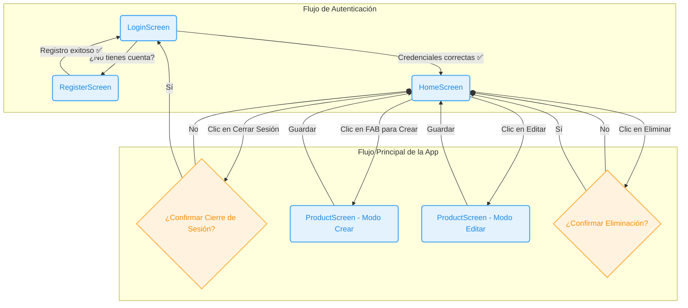

# Geova's SexShop

`Geova's SexShop` es una aplicación de Android desarrollada en Kotlin utilizando Jetpack Compose. Permite a los usuarios gestionar un inventario de productos, incluyendo funcionalidades de autenticación y operaciones CRUD (Crear, Leer, Actualizar, Eliminar).

## ✨ Características

*   **Autenticación de Usuarios:**
    *   Pantalla de **Registro** para nuevos usuarios.
    *   Pantalla de **Inicio de Sesión** para usuarios existentes.
*   **Gestión de Productos:**
    *   **Listar** todos los productos en la pantalla principal.
    *   **Agregar** nuevos productos a través de un formulario.
    *   **Editar** los detalles de productos existentes.
    *   **Eliminar** productos de la lista.
*   **Interfaz de Usuario Moderna:**
    *   Construida íntegramente con **Jetpack Compose**.
    *   Uso de **Material Design 3** para una apariencia limpia y moderna.
*   **Navegación:**
    *   Navegación fluida entre pantallas utilizando **Navigation Compose**.

## 📂 Estructura del Proyecto

El proyecto sigue una arquitectura simple y organizada, separando las responsabilidades en diferentes capas:

```
app/
└── src/
    └── main/
        ├── java/
        │   └── ec/edu/uce/appproductos/
        │       ├── data/
        │       │   ├── ProductRepository.kt  # Gestiona los datos de los productos (simulado)
        │       │   └── UserRepository.kt     # Gestiona los datos de los usuarios (simulado)
        │       ├── model/
        │       │   ├── Product.kt            # Modelo de datos para Producto
        │       │   └── User.kt               # Modelo de datos para Usuario
        │       ├── ui/
        │       │   ├── home/
        │       │   │   └── HomeScreen.kt     # Pantalla principal que lista los productos
        │       │   ├── login/
        │       │   │   └── LoginScreen.kt      # Pantalla de inicio de sesión
        │       │   ├── product/
        │       │   │   └── ProductScreen.kt    # Pantalla para crear/editar un producto
        │       │   ├── register/
        │       │   │   └── RegisterScreen.kt   # Pantalla de registro de usuario
        │       │   └── theme/                  # Tema de la aplicación (colores, tipografía)
        │       └── MainActivity.kt             # Actividad principal y grafo de navegación
        └── res/
            ├── drawable/
            └── values/
```

## 🌊 Flujo de Navegación

A continuación se muestra el diagrama de flujo que representa la lógica de navegación y las interacciones principales dentro de la aplicación.



## 🚀 Componentes Clave

### 1. `MainActivity.kt`

Es el punto de entrada de la aplicación. Contiene el `NavHost` que define el grafo de navegación entre las diferentes pantallas (`Login`, `Register`, `Home`, `Product`).

### 2. `data/`

*   **`UserRepository`**: Simula una base de datos de usuarios. Proporciona métodos para agregar y buscar usuarios.
*   **`ProductRepository`**: Simula una base de datos de productos. Ofrece métodos para obtener, agregar, actualizar y eliminar productos.

### 3. `ui/`

*   **`LoginScreen`**: Permite a los usuarios iniciar sesión. Valida las credenciales con `UserRepository`.
*   **`RegisterScreen`**: Permite a los nuevos usuarios registrarse en la aplicación.
*   **`HomeScreen`**: La pantalla principal después del inicio de sesión. Muestra una lista de productos y permite acceder a las funciones de agregar, editar y eliminar.
*   **`ProductScreen`**: Un formulario que se utiliza tanto para crear un nuevo producto como para editar uno existente.

## 🛠️ Dependencias Principales

*   **Jetpack Compose**: Para la construcción de la interfaz de usuario.
*   **Material Design 3**: Para los componentes visuales.
*   **Navigation Compose**: Para gestionar la navegación dentro de la aplicación.
*   **Kotlin Coroutines**: Para operaciones asíncronas (aunque en este proyecto se simulan).

## ⚙️ Cómo Ejecutar la Aplicación

1.  **Clonar el Repositorio:**
    ```bash
    git clone <URL_DEL_REPOSITORIO>
    ```
2.  **Abrir en Android Studio:**
    *   Abre Android Studio.
    *   Selecciona `Open an existing project` y elige el directorio del proyecto clonado.
3.  **Sincronizar Gradle:**
    *   Espera a que Android Studio sincronice y descargue todas las dependencias de Gradle.
4.  **Ejecutar la Aplicación:**
    *   Selecciona un emulador o conecta un dispositivo físico.
    *   Haz clic en el botón `Run 'app'` (▶️).

## 🤝 Contribuir

Las contribuciones son siempre bienvenidas. Si deseas mejorar esta aplicación, por favor, sigue estos pasos:

1.  Haz un "fork" de este repositorio.
2.  Crea una nueva rama (`git checkout -b feature/nueva-funcionalidad`).
3.  Realiza tus cambios y haz "commit" (`git commit -m 'Agrega nueva funcionalidad'`).
4.  Haz "push" a la rama (`git push origin feature/nueva-funcionalidad`).
5.  Abre un "Pull Request".


